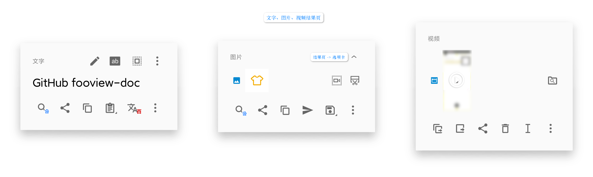

# fooView - 悬浮球

章首页会对一些名词进行解释，阅读过程中遇到不明白的来章首页查找。

* **悬浮球**：指显示在屏幕边缘的图标。

  

  * **悬浮球 -> 长按**：指长按悬浮球，在默认设置下弹出应用切换器的操作。

    

  * **悬浮球 -> 指针**：指拖动悬浮球后在悬浮图标附近显示的十字，相当于鼠标指针。

    

  * **悬浮球 -> 状态图标**：指拖动悬浮球后在悬浮图标附近显示的图标，提示用户在松手后会执行的对应功能。

    

* **结果页**：指进行取词、取图、录屏完成操作后弹出的操作界面。
  
  * **结果页 -> 选项卡**：根据在结果页显示的内容类型分为文字，图片以及视频选项卡，有着各自的顶栏、内容区域、工具栏；存在多个选项卡时，点击顶栏可以隐藏内容区域和工具栏。
  
    
  
* **主图标**：显示在桌面上的fooView图标，支持 APP Shortcuts。